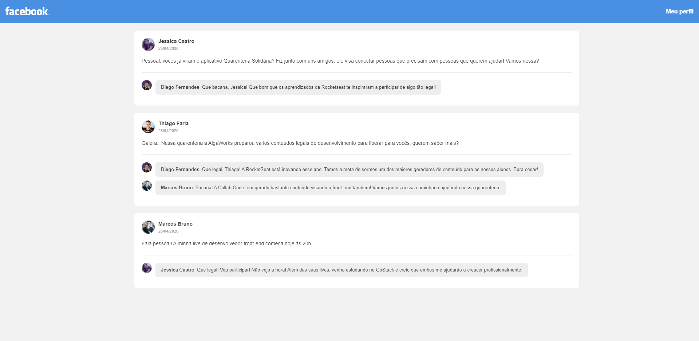

<table align="center" style="border: 0 !important" border="0">
  <tr>
    <td align="center" width="9999">
      

### Facebook Clone
<p>
  
   
   
   
  
</p>

<p></p>
</td></tr></table>


### Tela da aplicação :desktop_computer:



### Instalação :computer_mouse:
Baixe o repositório para uma pasta local:
```
git clone https://github.com/jessicacastro/facebook-clone.git
```
Navegue até a pasta 'facebook-clone', abra seu terminal e digite:
```
yarn
```

### Rodando a aplicação :gear:
No terminal, rode:
```
yarn dev
```
Após o comando, basta abrir sua aplicação no seu [localhost](http://localhost:8080)

### Contatos :email:
Linkedin - [@jessicacastros](https://www.linkedin.com/in/jessicacastros/)<br />
Github - [@jessicacastro](https://www.github.com/jessicacastro/)<br/>
Instagram - [@poxajessica](https://www.instagram.com/poxajessica) <br />
Twitter - [let name = Jessica](https://www.twitter.com/sapatilheira/)

### Licença :bulb:
[MIT](https://github.com/jessicacastro/facebook-clone/blob/master/LICENSE)

<hr />

Feito com :blue_heart: by [Jessica Castro](https://www.github.com/jessicacastro/) :woman_technologist:<br/>
